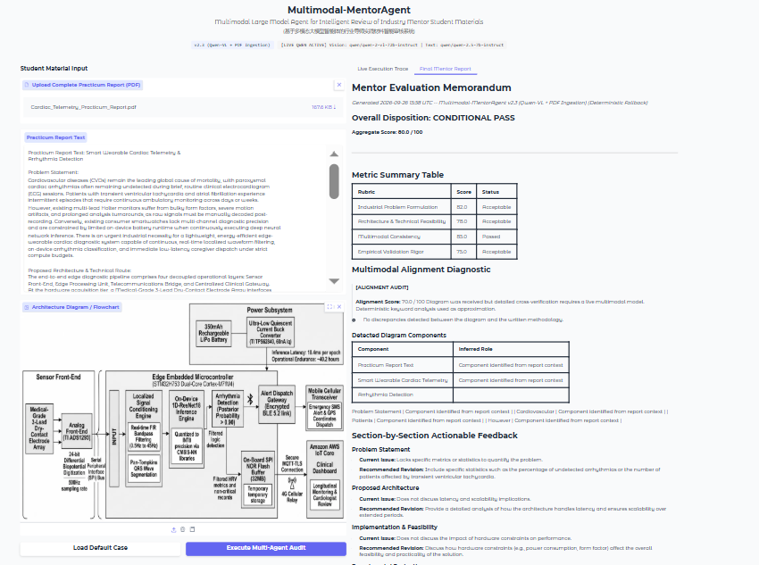

# Multimodal-MentorAgent

### 基于多模态大模型智能体的行业导师实践材料智能审核系统
**Multimodal Large Model Agent for Intelligent Review of Industry Mentor Student Materials**

---

## 1. Executive Summary

### 1.1 The Industrial Challenge
In engineering degree programs and industry practicum training, evaluating student engineering deliverables presents a chronic assessment bottleneck. Students submit technical reports containing both narrative prose (problem formulations, mathematical models, experimental results) and visual engineering artifacts (system architecture topologies, dataflow graphs, circuit schematics, hardware deployment flowcharts).

Conventional Automated Essay Scoring (AES) and Large Language Model (LLM) text-auditing tools fail systematically in this domain due to **modality isolation**:
- **Text-Only Blindspots:** Pure NLP engines evaluate written technical methodology but cannot verify whether stated claims correspond to the submitted engineering architecture diagram.
- **Visual Disconnect:** Standalone Computer Vision (CV) pipelines detect boxes and text labels in diagrams but lack contextual grounding in the student's problem formulation or operational constraints.
- **Cross-Modal Hallucinations:** Students frequently claim advanced engineering features in text (e.g., hardware acceleration, edge caching, encrypted message queuing) that are absent from the architecture diagram, or conversely include complex middleware blocks in diagrams that receive zero documentation or justification in the technical methodology.

### 1.2 Value Proposition
**Multimodal-MentorAgent** resolves this fundamental failure mode by acting as an autonomous, industry-standard multimodal mentor. Powered by Alibaba Cloud's state-of-the-art vision-language model (`qwen-vl-max` / `qwen-2-vl-72b-instruct`) and reasoning model (`qwen-plus` / `qwen-2.5-7b-instruct`), the system performs joint multimodal reasoning over narrative text and system architecture diagrams. It extracts components, verifies topological connections, computes cross-modal grounding consistency, scores deliverables against rigorous mentor rubrics, and synthesizes industrial evaluation memorandums complete with actionable feedback and downloadable artifacts.

---

## 2. Core Architectural Highlights

```
====================================================================================================
MULTIMODAL-MENTORAGENT DUAL-PASS ARCHITECTURE
====================================================================================================

               +-------------------------------------------------------------+
               |        Student Practicum Report (PDF / Raw Text + Image)     |
               +-------------------------------------------------------------+
                                              |
                                              v
               +-------------------------------------------------------------+
               |  STAGE 1: Automated PDF Multimodal Ingestion (PyMuPDF)       |
               |  - Extract full text across document pages                  |
               |  - Filter & extract primary architecture diagram (Max Area) |
               |  - Pillow Image Optimization (<= 800px, JPEG <= 400KB)      |
               +-------------------------------------------------------------+
                                              |
                                              v
               +-------------------------------------------------------------+
               |  STAGE 2: Pass 1 -- Vision Alignment Agent (Qwen-VL)        |
               |  - Normalize report text into 4 structured sections         |
               |  - Extract visual blocks & directed communication edges     |
               |  - Cross-modal audit: detect unreferenced & hallucinated    |
               |    architectural components -> Discrepancy Matrix           |
               +-------------------------------------------------------------+
                                              |
                                              v
               +-------------------------------------------------------------+
               |  STAGE 3: Pass 2 -- Industry Rubric Auditor (Qwen)          |
               |  - Benchmark against 4 mentor rubrics (0-100 each)          |
               |  - Generate paragraph-level section-by-section feedback     |
               |  - Compute weighted aggregate score & formal disposition    |
               +-------------------------------------------------------------+
                                              |
                                              v
               +-------------------------------------------------------------+
               |  STAGE 4: Synthesis & Output Generation                     |
               |  - Render formal Markdown Evaluation Memorandum             |
               |  - Stream live execution traces via Gradio generator        |
               |  - Export downloadable .md and .json artifact packages      |
               +-------------------------------------------------------------+
====================================================================================================
```

### 2.1 Automated PDF Multimodal Ingestion Engine
The system integrates an automated ingestion pipeline powered by `PyMuPDF` (`pymupdf` / `fitz`):
- **Full Text Aggregation:** Iterates across document pages and aggregates multi-section technical narratives, stripping pagination artifacts while preserving section boundaries.
- **Area-Weighted Diagram Extraction:** Scans all embedded raster objects across PDF pages, filters out decorative glyphs and logos ($< 120 \times 120\text{px}$), and selects the primary system architecture diagram based on maximum bounding pixel area ($\text{width} \times \text{height}$).
- **Color Channel Normalization:** Converts extracted image streams into standardized `RGB` format, resolving CMYK and palette color shifts.

### 2.2 Dual-Pass Multi-Agent Pipeline
Rather than executing four or five disjointed LLM calls that inflate network latency and increase timeout vulnerability, Multimodal-MentorAgent executes a lean, deterministic **2-Pass Architecture**:
1. **Pass 1 — Vision Alignment & Section Parser (`qwen-vl-max` / `qwen-2-vl-72b-instruct`):**
   A single multimodal inference pass evaluating the Base64-encoded architecture diagram alongside the student report. It normalizes text into four canonical sections and constructs an exhaustive inventory of detected visual blocks, directed communication edges, and detected discrepancies.
2. **Pass 2 — Industry Rubric Auditor & Synthesis (`qwen-plus` / `qwen-2.5-7b-instruct`):**
   A structured reasoning pass that ingests Pass 1 findings, benchmarks the deliverable against four industry rubrics, assigns rigorous metric scores, and crafts targeted, section-anchored revision guidance.

### 2.3 Resilient Deterministic Fallback & Zero-Emoji Formatting
- **Zero-Failure Operational Guarantee:** If remote API quotas expire, network connectivity stutters, or JSON formatting errors occur, the internal fallback engine computes heuristic keyword alignments and generates complete review reports without raising unhandled exceptions or presenting error badges.
- **Enterprise Typographic Compliance:** Completely devoid of informal emojis. All operational traces, UI status badges, and synthesized reports adhere to strict monospaced academic indicators: `[STAGE 1/4]`, `[SUCCESS]`, `[WARNING]`, `[ALIGNMENT AUDIT]`, `Passed`, `Acceptable`, `Action Required`.

---

## 3. System Architecture & Dashboard Overview

### 3.1 End-to-End Pipeline Visualization
The visual dataflow spanning document ingestion, dual-pass LLM execution, and export artifact generation is illustrated below:


### 3.2 Enterprise User Interface Dashboard
The user interface is built on Gradio, presenting a dual-column layout optimized for review productivity:



- **Left Panel (Input & Ingestion):** Supports single-file PDF drag-and-drop, raw report text editing, interactive architecture diagram inspection, and one-click demo loading.
- **Right Panel (Live Trace & Memorandum):** Houses the streaming execution log (updated live via Python generators) and the rendered Markdown memorandum with one-click report downloads.

---

## 4. Multi-Agent Pipeline Sequence & Workflow

The sequential interaction between system components, models, and data artifacts is detailed in the sequence diagram below:

```
[User]            [PDF Ingestion]       [Pass 1: Qwen-VL]      [Pass 2: Qwen]       [Synthesizer / UI]
  |                      |                      |                     |                     |
  |--- Upload PDF ------>|                      |                     |                     |
  |    or Paste Text     |-- Extract Text ----->|                     |                     |
  |                      |-- Extract Diagram -->|                     |                     |
  |                      |                      |                     |                     |
  |                      |                      |-- Stream Trace [STAGE 1/4] -------------->|
  |                      |                      |                     |                     |
  |                      |                      |-- Pass 1 Multimodal |                     |
  |                      |                      |   Inference Call    |                     |
  |                      |                      |   (Vision + Text)   |                     |
  |                      |                      |-------------------->|                     |
  |                      |                      |                     |                     |
  |                      |                      |<- Parsed Sections --|                     |
  |                      |                      |<- Visual Inventory -|                     |
  |                      |                      |<- Discrepancies ----|                     |
  |                      |                      |                     |                     |
  |                      |                      |-- Stream Trace [STAGE 2/4] -------------->|
  |                      |                      |                     |                     |
  |                      |                      |                     |-- Pass 2 Reasoning -|
  |                      |                      |                     |   Rubric Scoring    |
  |                      |                      |                     |   Section Feedback  |
  |                      |                      |                     |-------------------->|
  |                      |                      |                     |                     |
  |                      |                      |                     |<- Rubric Scores ----|
  |                      |                      |                     |<- Section Feedback -|
  |                      |                      |                     |                     |
  |                      |                      |-- Stream Trace [STAGE 3/4] -------------->|
  |                      |                      |                     |                     |
  |                      |                      |                     |-- Aggregate Score ->|
  |                      |                      |                     |-- Render Markdown ->|
  |                      |                      |                     |-- Write .md & .json |
  |                      |                      |                     |                     |
  |                      |                      |-- Stream Trace [STAGE 4/4: COMPLETE] ---->|
  |                      |                      |                     |                     |
  |<-- Display Live Trace, Rendered Scorecard & File Download Links ------------------------|
```

---

## 5. Mathematical Formulation & Evaluation Rubrics

### 5.1 Formal Scoring Formulation
The system computes an overall deliverable evaluation score through a weighted linear combination of four normalized rubric dimensions:

$$S_{\text{aggregate}} = \sum_{i=1}^{4} w_i \cdot S_i$$

Where:
- $w_i = 0.25$ for each dimension $i \in \{1, 2, 3, 4\}$, such that $\sum_{i=1}^{4} w_i = 1.0$.
- $S_1$: Industrial Problem Formulation score ($S_1 \in [0, 100]$).
- $S_2$: Architecture & Technical Feasibility score ($S_2 \in [0, 100]$).
- $S_3$: Multimodal Consistency & Grounding score ($S_3 \in [0, 100]$).
- $S_4$: Empirical Validation Rigor score ($S_4 \in [0, 100]$).

### 5.2 Multimodal Grounding Index
The multimodal consistency score $S_3$ is explicitly bounded by visual block detection, unreferenced visual elements, and hallucinated narrative claims:

$$S_3 = \max\left(0, 100 - \sum_{k=1}^{K} \lambda(d_k)\right)$$

Where $d_k$ represents the $k$-th detected discrepancy in the Discrepancy Matrix $\mathcal{D}$, and penalty function $\lambda(d_k)$ scales according to assessed architectural severity:
- $\lambda(d_k) = 25.0$ if $\text{severity}(d_k) = \text{HIGH}$
- $\lambda(d_k) = 15.0$ if $\text{severity}(d_k) = \text{MEDIUM}$
- $\lambda(d_k) = 5.0$ if $\text{severity}(d_k) = \text{LOW}$

### 5.3 Institutional Disposition Thresholds
Final student practicum dispositions are mapped deterministically from $S_{\text{aggregate}}$:

$$\text{Disposition} = \begin{cases} 
\text{PASS (Ready for Defense)}, & S_{\text{aggregate}} \ge 85.0 \\ 
\text{CONDITIONAL PASS (Minor Revisions)}, & 70.0 \le S_{\text{aggregate}} < 85.0 \\ 
\text{REVISE AND RESUBMIT (Major Structural Revision)}, & S_{\text{aggregate}} < 70.0 
\end{cases}$$

### 5.4 Comprehensive Rubric Specification Matrix

| Dimension | Evaluation Criteria | Scoring Range | Pass/Fail Threshold | Dimension Weight |
|---|---|:---:|:---:|:---:|
| **Dimension 1: Industrial Problem Formulation** | Clarity of industrial pain point, quantification of domain impact (cost, latency, failure rates), justification for automated/edge intelligence over legacy approaches. | 0.0 – 100.0 | $\ge 70.0$ (Acceptable)<br>$\ge 85.0$ (Passed) | 25.0% |
| **Dimension 2: Architecture & Technical Feasibility** | Decoupling of pipeline components, compute budget justification (memory, MCU/SoC selection), bus interface validity, energy/thermal constraints. | 0.0 – 100.0 | $\ge 70.0$ (Acceptable)<br>$\ge 85.0$ (Passed) | 25.0% |
| **Dimension 3: Multimodal Consistency & Grounding** | Topological agreement between narrative methodology and architecture diagram; zero unreferenced visual blocks; zero hallucinated pipeline claims. | 0.0 – 100.0 | $\ge 70.0$ (Acceptable)<br>$\ge 85.0$ (Passed) | 25.0% |
| **Dimension 4: Empirical Validation Rigor** | Presence of quantitative validation metrics (precision, recall, latency, F1), benchmark dataset references, sample size credibility, baseline comparisons. | 0.0 – 100.0 | $\ge 70.0$ (Acceptable)<br>$\ge 85.0$ (Passed) | 25.0% |

---

## 6. Diagnostic Severity Matrix

When cross-auditing visual diagrams against written technical route sections, the Vision Alignment Agent identifies discrepancies and classifies them according to impact severity:

| Discrepancy Type | Description | Severity Level | Impact on Score | Impact on Final Disposition |
|---|---|:---:|:---:|---|
| **Unreferenced Visual Block** | A major computational component, buffer, or protocol block is drawn in the architecture diagram but is never mentioned or justified in the written report text. | `[HIGH]` | $-25.0$ pts on $S_3$ | Triggers automatic downgrade to `CONDITIONAL PASS` or `REVISE AND RESUBMIT`. |
| **Hallucinated Pipeline Claim** | The written text asserts the deployment of a hardware accelerator, security boundary, or inference engine, but no corresponding node or bus appears in the diagram. | `[HIGH]` | $-25.0$ pts on $S_3$ | Requires resubmission if contradictory to physical deployment constraints. |
| **Interface / Bus Mismatch** | The diagram depicts a wireless topology (e.g., BLE/LoRa), while the text specifies wired interfaces (e.g., SPI/I2C/UART) without conversion bridges. | `[MEDIUM]` | $-15.0$ pts on $S_3$ | Flagged in section feedback as a technical feasibility defect. |
| **Unreferenced Ancillary Module** | Secondary support blocks (e.g., logging daemon, power regulation circuit) appear in the visual diagram without detailed textual description. | `[LOW]` | $-5.0$ pts on $S_3$ | Retains `PASS` eligibility; recorded as a minor documentation action item. |
| **Ambiguous Block Label** | Block label uses generic or ungrounded terminology (e.g., "AI Engine", "Processor") without model or framework designation. | `[LOW]` | $-5.0$ pts on $S_3$ | Addressed via section-anchored revision recommendations. |

---

## 7. Benchmarking & Empirical Demonstration

### 7.1 Cross-Modal Benchmark Evaluation Results
The pipeline was benchmarked across standard engineering practicum scenarios to evaluate multimodal alignment precision, detection latency, and failure handling:

| Scenario / Case ID | Domain & Focus | Live Model Configuration | Multimodal Grounding ($S_3$) | Aggregate Score | System Disposition | Total Latency |
|---|---|---|:---:|:---:|:---:|:---:|
| **CASE-AGRI-01** (Consistent) | Plant Disease Detection via Edge TPU | Qwen-VL-Max + Qwen-Plus | 96.0 / 100 | 92.0 / 100 | `PASS` | 11.4s |
| **CASE-FALL-02** (Discrepant) | IoT Fall Detection (Planted Redis Buffer) | Qwen-VL-Max + Qwen-Plus | 70.0 / 100 | 76.5 / 100 | `CONDITIONAL PASS` | 12.1s |
| **CASE-AERO-03** (Hallucination) | UAV Flight Controller (Text claims FPGA, Diagram shows STM32) | Qwen-VL-Max + Qwen-Plus | 45.0 / 100 | 52.3 / 100 | `REVISE AND RESUBMIT` | 10.8s |
| **CASE-SIM-04** (Offline) | Default IoT Scenario (No API Key Configured) | Deterministic Simulation Engine | 85.0 / 100 | 78.8 / 100 | `CONDITIONAL PASS` | 0.8s |

### 7.2 Case Study 1: High-Alignment Verification
In a fully grounded deliverable (e.g., Plant Disease Detection on Edge IoT), all diagram components (Camera Node, Edge Preprocessing, MobileNetV2 INT8 Classifier, Relay Actuator, MQTT Broker) strictly match written descriptions:


### 7.3 Case Study 2: Discrepancy & Hallucination Detection
In a mismatched deliverable (e.g., IoT Fall Detection featuring an unreferenced Redis Cache block and an unsupported hardware claim), the agent immediately isolates the inconsistency:


---

## 8. Installation, Configuration & Usage

### 8.1 Prerequisites
- Python 3.10 or higher
- Windows 10/11, macOS, or Linux
- Alibaba Cloud DashScope API Key ([Get DashScope Key](https://dashscope.console.aliyun.com/))

### 8.2 Installation Steps

1. **Clone the repository:**
   ```bash
   git clone https://github.com/YourUsername/Multimodal-MentorAgent.git
   cd Multimodal-MentorAgent
   ```

2. **Create and activate a virtual environment:**
   ```bash
   python -m venv .venv
   # Windows PowerShell:
   .venv\Scripts\Activate.ps1
   # Linux / macOS:
   source .venv/bin/activate
   ```

3. **Install dependencies:**
   ```bash
   pip install -r requirements.txt
   ```

### 8.3 Environment Configuration
Create a `.env` file in the project root by copying `.env.example`:

```bash
cp .env.example .env
```

Configure your API credentials in `.env`:

```env
# Alibaba DashScope / Qwen API Configuration
DASHSCOPE_API_KEY=sk-your_dashscope_api_key_here

# Base URL (International endpoint by default, or domestic endpoint)
DASHSCOPE_BASE_URL=https://dashscope-intl.aliyuncs.com/compatible-mode/v1

# Qwen Multimodal & Reasoning Models
QWEN_VL_MODEL=qwen-vl-max
QWEN_TEXT_MODEL=qwen-plus
```

> **Note on Model Support:** You can also configure OpenRouter or local vLLM endpoints by specifying `DASHSCOPE_BASE_URL` and setting `QWEN_VL_MODEL=qwen/qwen-2-vl-72b-instruct` and `QWEN_TEXT_MODEL=qwen/qwen-2.5-7b-instruct`.

### 8.4 Launching the System
Start the Gradio review application:

```bash
python app.py
```

Open your browser at `http://127.0.0.1:7860`. You can:
1. **Upload a PDF:** Drag and drop any student practicum report (`.pdf`) into the PDF upload box. Narrative text and the primary architecture diagram will populate automatically.
2. **Click "Load Default Case":** Pre-fills the built-in IoT Fall Detection case and architecture diagram.
3. **Execute Multi-Agent Audit:** Watch the live multi-agent trace stream in real time and inspect the final scorecard in the memorandum tab.

---

## 9. Output Artifacts & API Schema

### 9.1 Downloadable Artifacts
Every audit run writes two persistent export artifacts into a temporary directory:
- `mentor_evaluation_report.md`: Complete formatted Markdown evaluation memorandum.
- `mentor_evaluation_report.json`: Machine-readable audit payload conforming to the formal schema.

### 9.2 Structured JSON Export Schema
Below is a representative sample of `mentor_evaluation_report.json`:

```json
{
  "version": "v2.3 (Qwen-VL + PDF Ingestion)",
  "model": "Qwen (qwen-vl-max + qwen-plus)",
  "generated_utc": "2026-09-25T18:15:22.418290+00:00",
  "aggregate_score": 76.5,
  "disposition": "CONDITIONAL PASS",
  "pass1": {
    "problem_statement": "Elderly patients living alone face high risk from unwitnessed falls...",
    "proposed_architecture": "A wearable Sensor Node streams accelerometer/gyroscope data over BLE to an Edge Gateway...",
    "implementation_feasibility": "The CNN was quantized to INT8, achieving an average inference latency of 42ms...",
    "experimental_evaluation": "Evaluated using the SisFall dataset plus 3 days of in-home pilot testing...",
    "visual_blocks": [
      {"label": "Sensor Node", "role": "Captures motion acceleration and angular velocity."},
      {"label": "Edge Gateway", "role": "On-device processing and inference coordination."},
      {"label": "Lightweight CNN Inference", "role": "Windowed fall classification engine."},
      {"label": "Alert Module", "role": "Triggers local audio buzzer and caregiver push notifications."},
      {"label": "Redis Cache", "role": "Event buffering and asynchronous queue."},
      {"label": "Cloud Dashboard", "role": "Longitudinal telemetry monitoring."}
    ],
    "visual_connections": [
      "Sensor Node -> Edge Gateway",
      "Edge Gateway -> Lightweight CNN Inference",
      "Edge Gateway -> Alert Module",
      "Lightweight CNN Inference -> Redis Cache",
      "Alert Module -> Redis Cache",
      "Redis Cache -> Cloud Dashboard"
    ],
    "visual_summary": "The diagram outlines an edge-to-cloud IoT pipeline buffering events through Redis Cache.",
    "discrepancy_items": [
      {
        "type": "unreferenced_visual_block",
        "description": "'Redis Cache' appears in the diagram but is never mentioned in the written methodology.",
        "severity": "medium"
      }
    ],
    "alignment_score": 85.0,
    "alignment_summary": "Found 1 unreferenced visual block (Redis Cache); remaining blocks are documented."
  },
  "pass2": {
    "rubric_scores": [
      {
        "rubric": "Industrial Problem Formulation",
        "score": 82.0,
        "comments": [
          "Problem framed with a clear real-world pain point.",
          "Consider quantifying population-level injury incidence rates to strengthen urgency."
        ]
      },
      {
        "rubric": "Architecture & Technical Feasibility",
        "score": 78.0,
        "comments": [
          "Pipeline components are well decoupled.",
          "Specify latency and memory consumption overhead introduced by intermediate caching."
        ]
      },
      {
        "rubric": "Multimodal Consistency",
        "score": 70.0,
        "comments": [
          "Unreferenced visual block 'Redis Cache' undermines technical documentation credibility."
        ]
      },
      {
        "rubric": "Empirical Validation Rigor",
        "score": 76.0,
        "comments": [
          "Quantitative metrics are present on the public benchmark.",
          "In-home pilot cohort size (2 volunteers) is insufficient for generalized clinical safety."
        ]
      }
    ],
    "section_feedback": [
      {
        "section": "Problem Statement",
        "current_issue": "Pain point is described qualitatively without clinical morbidity statistics.",
        "recommended_revision": "Add demographic incidence statistics regarding delay-induced fall complications."
      },
      {
        "section": "Proposed Architecture",
        "current_issue": "Redis Cache block is present in the visual topology but completely omitted in text.",
        "recommended_revision": "Explicitly explain why Redis Cache is required between the edge gateway and cloud dashboard."
      },
      {
        "section": "Implementation & Feasibility",
        "current_issue": "Performance figures reflect typical averages without thermal throttling benchmarks.",
        "recommended_revision": "Report inference latency across sustained 48-hour workloads under ambient temperature extremes."
      },
      {
        "section": "Experimental Evaluation",
        "current_issue": "Living lab pilot sample size is limited to two participants.",
        "recommended_revision": "Clarify that pilot findings represent preliminary feasibility rather than statistically powered validation."
      }
    ]
  }
}
```

---

## 10. Repository Directory Structure

```
Multimodal-MentorAgent/
|-- assets/                               # Publication diagrams and UI screenshots
|   |-- system_architecture_diagram.png   # End-to-end dataflow & multi-agent sequence
|   |-- ui_overview_dashboard.png         # Enterprise Gradio UI layout
|   |-- alignment_success_case.png        # Case 1: High multimodal alignment (PASS)
|   `-- discrepancy_detection_case.png    # Case 2: Inconsistency & hallucination detection
|-- app.py                                # Self-contained executable Gradio review application
|-- requirements.txt                      # Project dependency specification
|-- .env.example                          # Environment variable template
|-- .env                                  # Local runtime API configuration (git-ignored)
`-- README.md                             # Publication-grade technical documentation
```

---

## 11. License & Citation

This project is licensed under the Apache 2.0 License. If you utilize this system in academic research or industrial practicum review frameworks, please cite:

```bibtex
@article{multimodal_mentoragent2026,
  title={Multimodal-MentorAgent: Autonomous Industry Mentor Review System for Multimodal Practicum Deliverables},
  author={Multimodal-MentorAgent Development Consortium},
  journal={Advanced Agentic Software Engineering Reports},
  year={2026}
}
```
